# Developer Guide

---

## Acknowledgements

This project is based on **AddressBook-Level3 (AB3)** from the [SE-EDU initiative](https://se-education.org).  
We adapted its architecture, parser logic, and command execution framework.

We also acknowledge:

- [PlantUML](https://plantuml.com) for UML diagram generation.
- NUS CS2113 teaching team for guidance and templates.

---

## Design & Implementation

**Mama** is a Command Line Interface (CLI) health-tracking application designed for mothers to log meals, workouts, milk
pumping sessions, and body measurements.  
It helps users monitor nutrition, exercise, and postpartum recovery — all stored locally for privacy.

Mama follows the **AB3 layered architecture**, extended with additional commands and models.

---

### 2.1 Architecture

> **[Insert Architecture Diagram: `images/ArchitectureDiagram.png`]**

| Layer       | Responsibility                                                |
|-------------|---------------------------------------------------------------|
| **UI**      | Handles user input and output (`Mama`, `Ui`)                  |
| **Logic**   | Parses and executes commands (`Parser`, `Command` subclasses) |
| **Model**   | Stores data (`EntryList`, `Entry`, and subclasses)            |
| **Storage** | Saves/loads data to/from file (`Storage`)                     |
| **Commons** | Shared classes (`CommandResult`, `CommandException`, etc.)    |

The UI reads user commands and passes them to Logic for parsing. Logic constructs a `Command` and executes it on the
Model. The Model updates state and Logic instructs Storage to persist data. UI renders the `CommandResult` to the user.

---

### 2.2 UI Component

- **Classes:** `Mama.java`, `Ui.java`
- Handles user I/O via console.
- Passes raw input strings to `Parser`.
- Displays responses and error messages.

---

### 2.3 Logic Component

- **Classes:** `Parser`, `Command`, and subclasses (`AddMealCommand`, `AddWorkoutCommand`, `AddMilkCommand`,
  `AddMeasurementCommand`, `ListCommand`, `DeleteCommand`)
- Implements the **Command Pattern**.
- Each command defines an `execute()` method encapsulating its specific logic.

---

### 2.4 Model Component

- **Classes:** `Entry`, `MealEntry`, `WorkoutEntry`, `MilkEntry`, `BodyMeasurementEntry`, `EntryList`
- Represents application data.
- Supports operations for adding, deleting, filtering, and listing entries.
- Uses `EntryType` enum for type safety.

---

### 2.5 Storage Component

- **Class:** `Storage`
- Handles reading and writing persistent data in a text file (`mama.txt`).
- Each line in the file stores an entry separated by `|`.

#### Example File Content

> MEAL|breakfast|500
> WORKOUT|yoga|45|28/10/25 02:33 
> MILK|120ml|28/10/25 02:32
> MEASURE|70|98|90|55|30|28/10/25 02:53

| Field | Description                                       |
|-------|---------------------------------------------------|
| 1     | Entry type (`MEAL`, `WORKOUT`, `MILK`, `MEASURE`) |
| 2     | Description (e.g., *breakfast*, *yoga*)           |
| 3     | Value/details (e.g., *500 kcal*, *30min*)         |
| 4     | Date recorded                                     |

---

### 2.6 Common Classes

- **Classes:** `CommandResult`, `CommandException`, `Messages`
- Provide utilities, error messages, and shared data structures.

---

### 3. Implementation

This section documents the design and implementation of major features.

---

### 3.1 List Command Filter — Lee Yi Sheng

#### Overview

The `ListCommand` allows users to display entries recorded in the application.  
Users can also filter entries by type (e.g., meals, workouts, milk, or measurements) using the `/t` flag.  
This feature helps users quickly view relevant records without scrolling through the entire list.

#### Design

| Component           | Description                                                                                     |
|---------------------|-------------------------------------------------------------------------------------------------|
| **Command Class**   | `ListCommand` — Displays all entries or filters them by type.                                   |
| **Parser Class**    | `ListCommandParser` — Parses user input (e.g., `/t meal`) and creates a `ListCommand` instance. |
| **Model**           | `EntryList` — Provides methods for retrieving and filtering entries.                            |
| **EntryType Enum**  | Defines valid entry types (`MEAL`, `WORKOUT`, `MILK`, `MEASURE`).                               |
| **Flow of Control** | `Parser → ListCommand → EntryList → Ui`                                                         |

#### Implementation Steps

```
list /t meal
```

1. `Parser` interprets `/t meal` as `EntryType.MEAL`.
2. `ListCommand` retrieves and filters `EntryList`.
3. `Ui` prints the filtered list.

> **[Insert Sequence Diagram: `images/ListCommandSequenceDiagram.png`]**

#### Alternatives Considered

| Option                                             | Reason for Rejection |
|----------------------------------------------------|----------------------|
| Separate list commands (`listmeal`, `listworkout`) | Too redundant        |
| Keyword filtering                                  | Ambiguous results    |

#### Future Extensions

```
list /t meal /d today
```

---

### 3.2 Delete Feature — Ong Yu Jie

#### Overview

The `DeleteCommand` allows users to remove an existing entry from the application using its **1-based index** shown in
the `list` command.  
When executed, it validates the given index, deletes the corresponding entry from the `EntryList`, and then saves the
updated list to local storage (`mama.txt`).

#### Implementation Details

Given below is an example usage scenario and how the deletion mechanism behaves step-by-step.

**Step 1. The user enters the command `delete 2`.**

The command is captured by the `Ui`, representing the user’s intention to remove the 2nd item.

At this stage, the current `EntryList` still contains all entries.

> 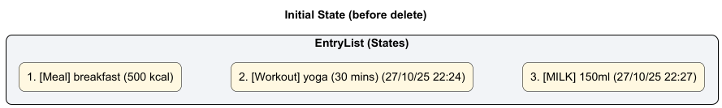

**Step 2. The `Parser` interprets the command and creates a `DeleteCommand` object.**

It extracts the index argument (`2`) and returns a new `DeleteCommand(index=2)` instance to the Logic component.

> 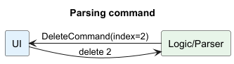

**Step 3. The `DeleteCommand#execute()` method is invoked.**

It first validates whether the provided index is within the valid range of the `EntryList`.

If the index exceeds the list size, a `CommandException` is thrown with an error preview of the existing entries.

If valid, the corresponding entry is removed from the list.

> 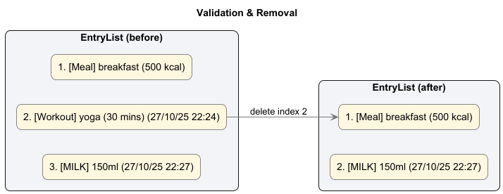

**Step 4. The updated list is persisted immediately to storage.**

After deletion, the command calls `Storage#save(list)` to update `mama.txt`.

This ensures the deletion is saved even if the application exits unexpectedly.

> 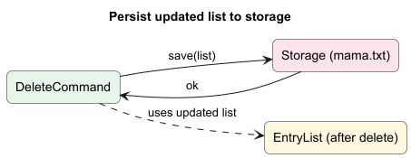

**Step 5. The result message is returned to the `Ui`.**

A success message such as `Deleted: [Workout] yoga (30 mins) (27/10/25 22:24)` is displayed to the user.

If the index is invalid, an error message and the current entry list are shown instead.

```
Invalid index: 9
Here are your entries:
1. [Meal] breakfast (500 kcal)
2. [Workout] yoga (30 mins) (27/10/25 22:24)
3. [MILK] 150ml (27/10/25 22:27)
```

> **DeleteCommand Sequence Diagram**  
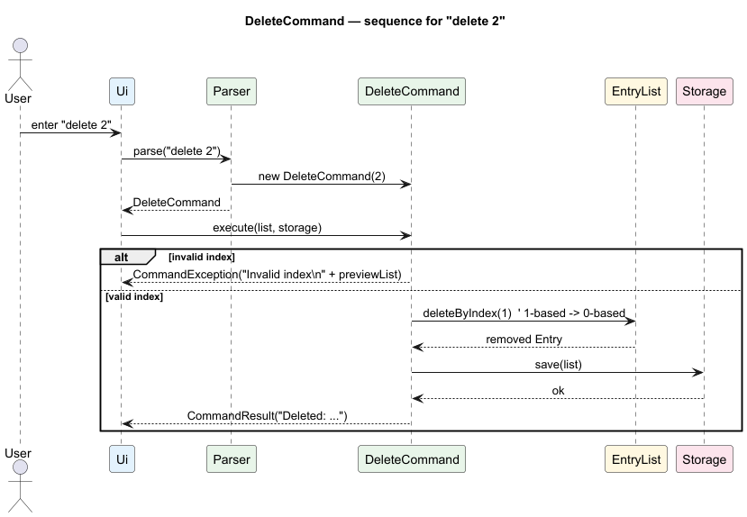

#### Design Considerations

**Aspect: Data Deletion Mechanism**

| Alternative                   | Pros                         | Cons                                                |
|-------------------------------|------------------------------|-----------------------------------------------------|
| **Delete by index (current)** | Simple and clear to the user | Requires referencing the list index                 |
| Delete by keyword             | Intuitive for text search    | Ambiguous when multiple entries share similar names |

**Aspect: Data Persistence**

| Alternative                             | Pros                                  | Cons                                                      |
|-----------------------------------------|---------------------------------------|-----------------------------------------------------------|
| **Save after every deletion (current)** | Guarantees data integrity; crash-safe | Slightly slower if multiple deletions occur consecutively |
| Save only on exit                       | Improves performance                  | Risk of data loss if the app crashes                      |

#### Summary

- **Command word:** `delete`
- **Input format:** `delete INDEX`
- **Example:** `delete 2`
- **Result:** Removes the entry at position `2` from the list and updates `mama.txt` immediately.

This implementation ensures data safety and provides clear user feedback for both successful and invalid deletions.

---

### 3.3 Body Measurement Feature — Ong Yu Jie

#### Overview

The `AddMeasurementCommand` logs **waist** and **hips** (required) with optional **chest**, **thigh**, **arm** — all in **cm**.  
On success, it creates a **timestamped** `BodyMeasurementEntry` (via `TimestampedEntry`) and persists the updated list using `Storage#save(list)`.  
**All new entries include a timestamp** formatted with `DateTimeUtil` as `dd/MM/yy HH:mm`.

#### Implementation Details

**Step 1 — User issues a command**  
The user enters, for example:
```measure waist/70 hips/98 chest/90 thigh/55 arm/30```

> 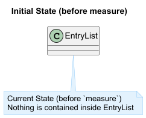

The `Ui` captures the raw input.

**Step 2 — Parse into a command**  
`Parser` extracts integer values and constructs:
`AddMeasurementCommand(waist=70, hips=98, chest=90, thigh=55, arm=30)`.
> 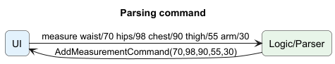

**Step 3.** `AddMeasurementCommand#execute(list, storage)` validates:

- **Required:** `waist`, `hips` must be present and **> 0**.
- **Optional:** `chest`, `thigh`, `arm` if present must be **> 0**.  
  If validation fails → `CommandException`.  
  If valid → create `BodyMeasurementEntry` and append to `EntryList`.

> 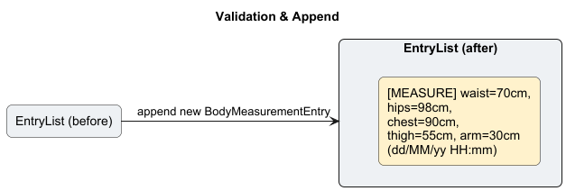

**Step 4.** Persist: `Storage#save(list)`.
> 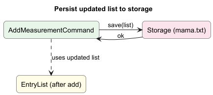

**Step 5.** `Ui` prints 
```Added: [MEASURE] waist=70cm, hips=98cm, chest=90cm, thigh=55cm, arm=30cm (28/10/25 02:53)```.

> **AddMeasurement Sequence Diagram**
> 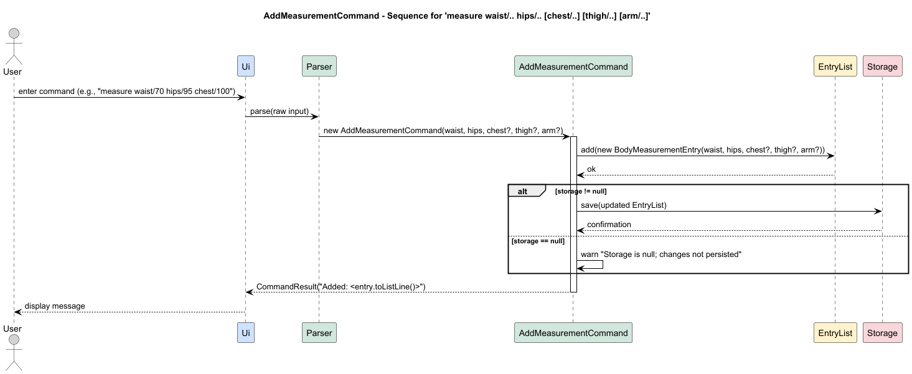

#### Design Considerations

**Aspect: Required vs optional fields**

| Choice                              | Pros                              | Cons                              |
|-------------------------------------|-----------------------------------|-----------------------------------|
| **Waist & hips required (current)** | Ensures core metrics are captured | Slightly stricter input           |
| All optional                        | Flexible                          | Risk of empty/less useful entries |

#### Summary

- **Command:** `measure waist/<cm> hips/<cm> [chest/<cm>] [thigh/<cm>] [arm/<cm>]`
- **Example:** `measure waist/70 hips/98 chest/90`
- **Effect:** Appends a `BodyMeasurementEntry` and saves immediately.

---

### 3.4 Add Meal — [Teammate / Owner]

#### Overview

`AddMealCommand` lets users record a meal with a short description and calories.  
The command validates basic input, appends a `MealEntry` to `EntryList`, and persists immediately via
`Storage#save(list)`.

#### Implementation Details

**Step 1.** The user enters `add meal breakfast /c 500`. The `Ui` captures the raw input.
> 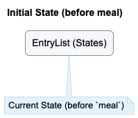

**Step 2.** `Parser` recognises `add meal` and constructs `AddMealCommand(description="breakfast", calories=500)`.
> 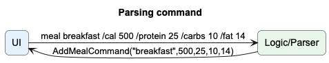

**Step 3.** `AddMealCommand#execute(list, storage)` validates that calories is a positive integer and description is
non-empty. If invalid, a `CommandException` is thrown; no mutation/save occurs.  
If valid, a new `MealEntry` is created and appended to `EntryList`.
> 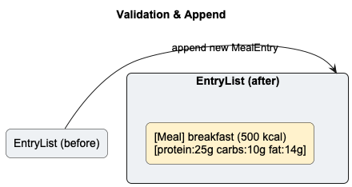

**Step 4.** `Storage#save(list)` is called to write the updated list to `mama.txt`.
> 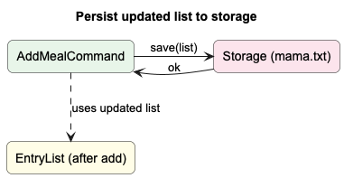

**Step 5.** `Ui` prints the result (e.g., `Added: [Meal] breakfast (500 kcal)`).

> 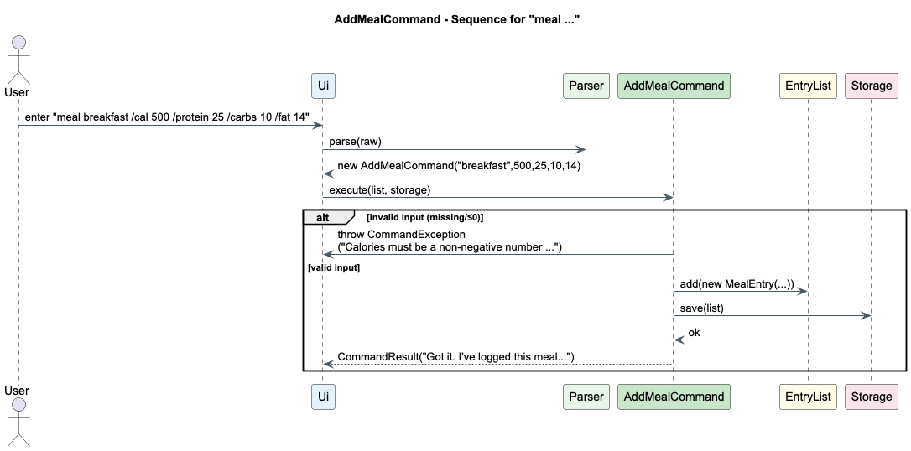

#### Design Considerations

**Aspect: Input format**

| Alternative                                   | Pros                               | Cons                                 |
|-----------------------------------------------|------------------------------------|--------------------------------------|
| **`add meal <desc> /c <calories>` (current)** | Clear calories flag; easy to parse | Slightly longer to type              |
| `add meal <desc> <calories>`                  | Short                              | Ambiguity if desc ends with a number |

**Aspect: Validation**

| Rule                                | Rationale                             |
|-------------------------------------|---------------------------------------|
| Calories must be a positive integer | Avoids invalid/negative energy values |
| Description must be non-empty       | Prevents meaningless entries          |

#### Summary

- **Command:** `add meal <description> /c <calories>`
- **Example:** `add meal breakfast /c 500`
- **Effect:** Appends a `MealEntry` and saves to disk immediately.

---

### 3.5 Add Workout — [Teammate / Owner]

#### Overview

`AddWorkoutCommand` records a workout with a type/description and duration.  
It validates inputs, appends a `WorkoutEntry`, and persists via `Storage#save(list)`.

#### Implementation Details

**Step 1.** User enters `add workout yoga /d 30min`. `Ui` captures input.
> 

**Step 2.** `Parser` builds `AddWorkoutCommand(description="yoga", duration="30min")`.
> 

**Step 3.** `AddWorkoutCommand#execute(...)` validates non-empty description and non-empty duration; throws
`CommandException` if invalid.  
If valid, a `WorkoutEntry` is created and added to `EntryList`.
> 

**Step 4.** `Storage#save(list)` persists the updated list.
> 

**Step 5.** `Ui` displays success (e.g., `Added: [Workout] yoga (30 mins)`).
> 

#### Design Considerations

**Aspect: Duration representation**

| Alternative                          | Pros                   | Cons                                |
|--------------------------------------|------------------------|-------------------------------------|
| **Free text like `30min` (current)** | Flexible, easy to type | Harder to aggregate without parsing |
| Normalised minutes (e.g., `30`)      | Easy to compute totals | Less user-friendly input            |

#### Summary

- **Command:** `add workout <description> /d <duration>`
- **Example:** `add workout yoga /d 30min`
- **Effect:** Appends a `WorkoutEntry` and saves immediately.

---

### 3.6 Add Milk — [Teammate / Owner]

#### Overview

`AddMilkCommand` logs a pumping session volume (in ml).  
It validates the volume, appends a `MilkEntry`, and persists via `Storage#save(list)`.

> **Note:** Current implementation **does not** require/record a time-of-day label like “morning”. The entry stores
> volume (and timestamp/date if your `Entry` base adds it automatically).

#### Implementation Details

**Step 1.** User enters `add milk /v 150`. `Ui` captures input.
> 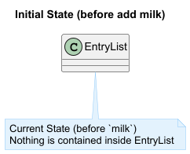

**Step 2.** `Parser` constructs `AddMilkCommand(volume=150)`.
> 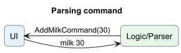

**Step 3.** `AddMilkCommand#execute(...)` checks `volume > 0`. If invalid, throws `CommandException`. If valid, appends
a `MilkEntry`.
> 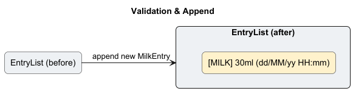

**Step 4.** `Storage#save(list)` persists the updated list.
> 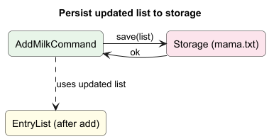

**Step 5.** `Ui` shows `Added: [Milk] 150ml`.
> 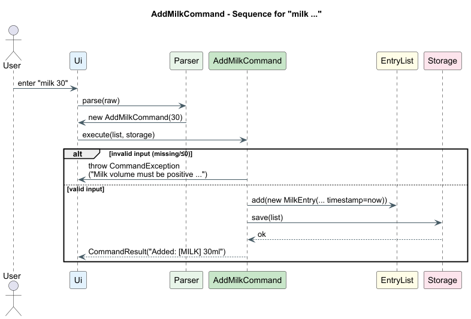

#### Design Considerations

**Aspect: Volume input**

| Alternative                       | Pros            | Cons                                |
|-----------------------------------|-----------------|-------------------------------------|
| **Positive integer ml (current)** | Simple, uniform | No fractional ml                    |
| Decimal ml                        | Precise         | Extra parsing/validation complexity |

#### Summary

- **Command:** `add milk /v <volume-ml>`
- **Example:** `add milk /v 150`
- **Effect:** Appends a `MilkEntry` and saves immediately.

---

## Product Scope

### Target User Profile

| Attribute           | Description                                               |
|---------------------|-----------------------------------------------------------|
| **Primary User**    | Mothers managing postpartum health                        |
| **Technical Skill** | Basic CLI knowledge                                       |
| **Needs**           | Log and view meals, workouts, milk, and body measurements |
| **Motivation**      | Monitor consistency and recovery progress privately       |

---

### Value Proposition

Mama offers an **offline**, **privacy-friendly**, and **easy-to-use** health-tracking system for mothers.  
Unlike typical mobile apps, Mama stores all information locally and works without internet access.

---

## User Stories

| Version | As a ...             | I want to ...                 | So that I can ...                |
|---------|----------------------|-------------------------------|----------------------------------|
| v1.0    | mom                  | log my meals quickly          | monitor calorie intake           |
| v1.0    | mom                  | log workouts                  | track physical progress          |
| v1.0    | mom                  | record milk pumping           | remember milk volume             |
| v1.0    | mom                  | record my weight              | monitor postpartum weight loss   |
| v1.0    | mom who is forgetful | delete wrong entries          | remove incorrect logs            |
| v1.0    | curious mom          | list all entries              | view recorded data               |
| v2.0    | mom                  | set calorie goals             | manage daily nutrition           |
| v2.0    | mom                  | set weekly fitness goals      | stay consistent                  |
| v2.0    | mom                  | see daily milk totals         | ensure baby supply is sufficient |
| v2.0    | mom                  | track last pumping time       | plan next session                |
| v2.0    | mom                  | view nutrient breakdown       | maintain balanced diet           |
| v2.0    | mom                  | save common meals             | re-enter quickly                 |
| v2.0    | mom                  | find safe postpartum workouts | avoid injury                     |
| v2.0    | mom                  | log feelings after workouts   | track recovery                   |
| v2.0    | mom                  | track body measurements       | observe gradual progress         |
| v2.0    | mom                  | set reminders                 | avoid missing tasks              |
| v2.1    | mom                  | view health dashboard         | see overall progress             |

---

## Non-Functional Requirements

1. Must run on Java 11+.
2. Startup time ≤ 2 seconds.
3. Handles up to 10,000 entries smoothly.
4. File size ≤ 10 MB.
5. Commands execute ≤ 1 second.
6. Fully offline operation.
7. Conforms to CS2113 coding standards.
8. Modular structure for easy maintenance.

---

## Glossary

| Term          | Definition                                   |
|---------------|----------------------------------------------|
| **Entry**     | A record (Meal, Workout, Milk, Measurement). |
| **EntryList** | Container class managing all entries.        |
| **Parser**    | Converts user input into a command.          |
| **Command**   | Encapsulates a single executable action.     |
| **CLI**       | Command Line Interface.                      |
| **SRP**       | Single Responsibility Principle.             |
| **LoD**       | Law of Demeter.                              |

---

## Instructions for Manual Testing

### 1. Launching the Application

### 2. Loading Sample Data

Replace the existing `mama.txt` with `sample_mama.txt` before launch.

### 3. Example Commands

| Command                  | Expected Output                |
|--------------------------|--------------------------------|
| `add meal breakfast 500` | Adds a meal entry              |
| `list`                   | Displays all entries           |
| `delete 2`               | Deletes the second entry       |
| `measure weight 70`      | Adds a measurement entry       |
| `list /t measure`        | Lists only measurement entries |

### 4. Error Scenarios

| Command             | Expected Output         |
|---------------------|-------------------------|
| `delete 99`         | “Invalid index”         |
| `measure waist abc` | “Invalid number format” |
| `add milk -50`      | “Invalid milk volume”   |

## Appendix: Requirements, Glossary, and Notes

### Requirements

- The application shall operate in CLI mode.
- Data shall persist automatically on exit.

---

### Notes

- For testing, use small datasets before scaling to 10,000 entries.
- The file `mama.txt` can be safely deleted to reset data.

